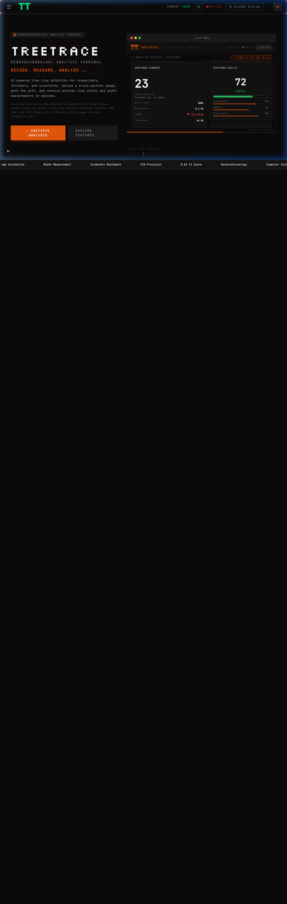
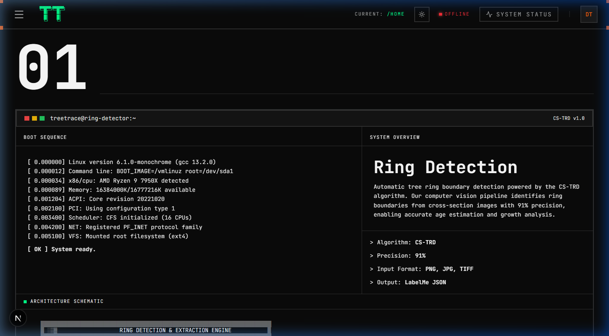
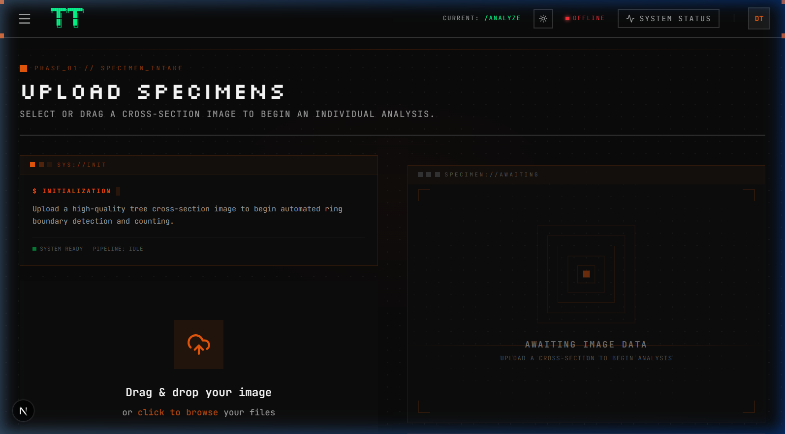
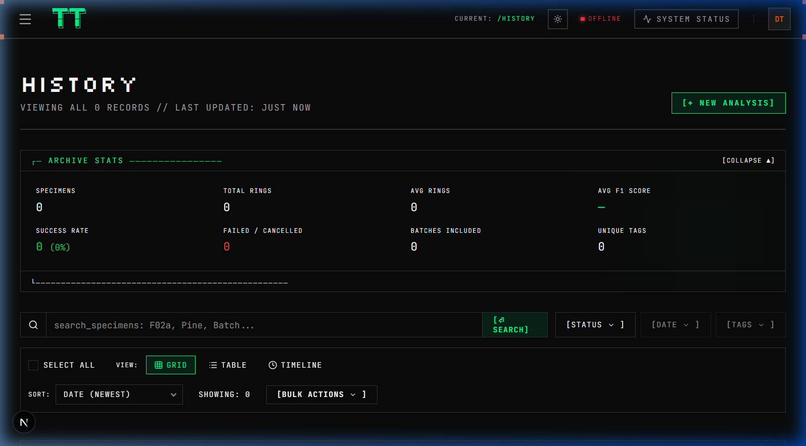
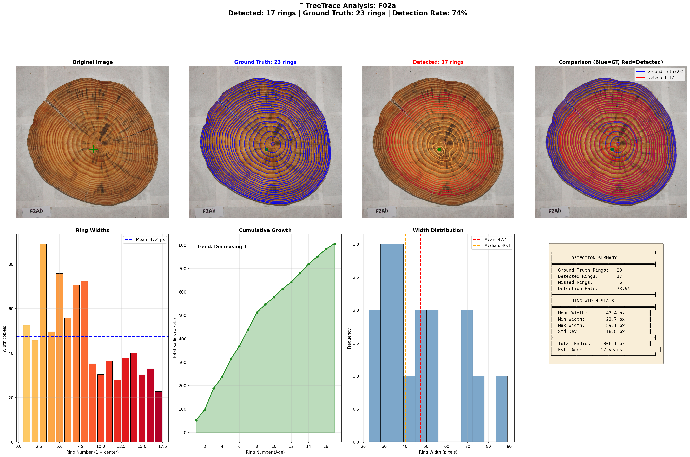

<div align="center">

# 🌲 TreeTrace

### AI-Powered Tree Ring Detection & Dendrochronology Analysis

Upload a cross-section image, mark the pith, and get precise ring counts,
width measurements, and ecological analytics in seconds.

[](https://python.org)
[](https://nextjs.org)
[](https://fastapi.tiangolo.com)
[](https://react.dev)
[](https://docker.com)
[](LICENSE)

</div>

---

## Screenshots

**Landing Page** — Industrial brutalist UI with live demo player and system status indicators.


**Ring Detection Feature** — CS-TRD algorithm overview with boot sequence terminal and architecture schematic.


**Upload Pipeline** — Guided specimen intake with drag-and-drop, real-time system status, and specimen preview panel.


**Analysis History** — Searchable archive with grid/table/timeline views, filtering by status, date, and tags.


**Ring Detection Overlay** — Detected rings (green→red gradient) vs. ground truth annotations (blue) on a real cross-section.


**Full Analysis Dashboard** — Original image, ground truth comparison, detected boundaries, ring width bar chart, cumulative growth curve, width distribution histogram, and detection summary stats.


---

## What It Does

TreeTrace wraps the [CS-TRD](https://github.com/hmarichal93/cstrd) (Concentric Shape Tree Ring Detection) computer vision algorithm in a full-stack web application. The CS-TRD pipeline processes high-resolution cross-section photographs through polar coordinate transformation, edge detection, and concentric shape segmentation to extract ring boundary polygons.

The web app adds on top of that:

- **Guided 4-step pipeline** — Upload → Pith Selection → Processing → Results
- **Interactive ring map** — Canvas-based polygon renderer with pan/zoom over the original image
- **Growth analytics** — Ring width distributions, cumulative growth curves, trend analysis
- **Health scoring** — Consistency, stress resistance, recovery metrics
- **Ecological context** — Estimated age, biomass, carbon sequestration equivalents, specimen biography
- **Data export** — CSV and JSON export of all ring measurements
- **Session history** — Persistent record of all analyses with search and instant resume

Supports PNG, JPEG, and TIFF formats. Works with both conifer and hardwood specimens.

---

## Tech Stack

### Frontend — `08_Deployment/Frontend/`

| | |
|:--|:--|
| **Next.js 16** | App router, SSR, API proxy |
| **React 19** | Hooks, context, component architecture |
| **Tailwind CSS 4** | Industrial brutalist design system |
| **Framer Motion** | Transitions, micro-animations, processing simulations |
| **Recharts** | Width distribution & cumulative growth charts |
| **Radix UI** | Accessible primitives (dialogs, dropdowns, tooltips) |
| **Prisma + SQLite** | Analysis history persistence |
| **Three.js / R3F** | 3D and cinematic landing elements |

### Backend — `08_Deployment/Backend/`

| | |
|:--|:--|
| **FastAPI** | Async REST API |
| **Pydantic** | Request/response validation |
| **OpenCV** | Image preprocessing, overlay rendering |
| **NumPy / SciPy** | Ring width calculation, statistical analysis |
| **Pillow** | Image format handling |

### Core Algorithm — CS-TRD

The open-source [CS-TRD](https://github.com/hmarichal93/cstrd) library. Image → polar transform → edge detection → ring segmentation → polygon extraction → LabelMe JSON output.

---

## Getting Started

### Prerequisites

- **Node.js** 18+
- **Python** 3.11+
- **Git** 2.30+

### Setup

```bash
# Clone
git clone https://github.com/pranaysoyam1265/Tree-Trace-AI-Powered-Tree-Ring-Detection.git
cd Tree-Trace-AI-Powered-Tree-Ring-Detection

# Backend
python -m venv .venv
.venv\Scripts\activate        # Windows
# source .venv/bin/activate   # macOS/Linux
pip install -r 08_Deployment/Backend/requirements.txt

# CS-TRD (required for detection)
git clone --depth 1 https://github.com/hmarichal93/cstrd.git cstrd_ipol

# Frontend
npm run install-frontend

# Environment
cp 08_Deployment/Frontend/.env.example 08_Deployment/Frontend/.env.local
```

### Run

```bash
# Terminal 1 — Backend on :8000
cd 08_Deployment/Backend
python main.py

# Terminal 2 — Frontend on :3000
npm run dev
```

Open [http://localhost:3000](http://localhost:3000).

### Docker

```bash
docker build -t treetrace .
docker run -p 8000:8000 treetrace
```

---

## API

The backend serves a REST API with Swagger docs at `/docs` when running.

| Method | Endpoint | Description |
|:--|:--|:--|
| `GET` | `/health` | Health check |
| `POST` | `/api/analyze` | Upload image + pith → run detection |
| `GET` | `/api/results/{id}` | Get analysis results |
| `GET` | `/api/samples` | List sample images |

---

## CLI

Standalone CLI for batch processing:

```bash
python 09_Scripts/treetrace.py --image F02a
```

| Flag | What it does |
|:--|:--|
| `--image` | Image path or dataset name |
| `--pith x,y` | Manual pith coordinates |
| `--scale` | px/mm for metric conversion |
| `--no-gt` | Skip ground truth comparison |
| `--no-viz` | Skip generating visualizations |
| `--quick` | Minimal output |

Generates ring overlays, analysis charts, width CSVs, and review JSONs for human-in-the-loop correction.

---

## Project Structure

```
TreeTrace/
├── 08_Deployment/
│   ├── Frontend/          # Next.js web app
│   │   ├── app/           #   Routes: analyze, results, history, batch, etc.
│   │   ├── components/    #   analysis/, results/, ascii-hub/, dendrolab/, cinematic/
│   │   ├── lib/           #   Contexts, hooks, utilities
│   │   └── prisma/        #   DB schema
│   ├── Backend/           # FastAPI REST API
│   │   ├── routes/        #   analyze, results, samples, health
│   │   ├── services/      #   CS-TRD wrapper & pipeline
│   │   └── schemas/       #   Pydantic models
│   └── Streamlit_App/     # Legacy Python dashboard
├── 09_Scripts/            # CLI & evaluation tools
├── 06_ML_Core/            # Experimental ML pipeline (MAE, U-Net, GNN)
├── 11_Docs/               # Architecture, model details, API reference
├── Dockerfile             # Containerized backend
└── package.json           # Root monorepo scripts
```

---

## ML Research Pipeline

Experimental deep learning models beyond CS-TRD:

| Model | Architecture | Role |
|:--|:--|:--|
| MAE | Vision Transformer | Self-supervised pre-training (768-dim embeddings) |
| Segmenter | U-Net | Binary ring boundary segmentation |
| GraphNet | GCN | Ring topology & relationship analysis |
| Anomaly Detector | Gradient Boosting | False/missing ring identification |

---

## Contributing

1. Frontend TypeScript types must match backend Pydantic schemas — run `npm run build` before committing.
2. Run `npm run lint` for the frontend.
3. Test detection accuracy with `09_Scripts/evaluate_detection.py` against the URuDendro benchmark.

---

## License

[MIT](LICENSE)
